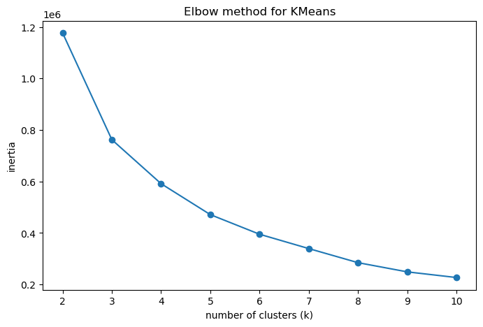
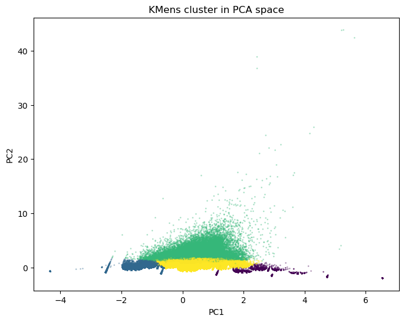

# Luiss_Audience_Decode_319201
Audience Decode Project 319201
Audience Decode 319201

Team:
Gianni Dacchille 313201
Lorenzo Molinari 320811
Aldo Ramezzana 319201

The Audience Decode Project explores how users interact with movies, with the goal of understanding different audience behaviors. By analayzing user-movie interaction data, the project identifies distinct user profiles using unsupervisex machine leanring techniques.

Methodology:

1) Loading and cleaning the dataset
2) Explonatory Data Analysis (EDA) to understand overall trends
3) Feature engineering at the user level to capture behavior patterns
4) Feature scaling to ensure comparability
5) Dimensionally reduction unsing PCA
6) Clustering users with KMeans to uncover distinct profiles

Results

The clustering analysis revealed four distinct user profiles, primarily differentiated by engagement intensity and rating behavior:

- Low-activity users with few ratings and lower average scores  
- Moderate users with balanced engagement and stable ratings  
- Highly engaged users who rate many movies and show consistent preferences  
- Extreme users characterized by very high activity and a wide rating range  

A PCA projection of the clustered users highlights clear structural differences between these groups.

The elbow method was used to identify a reasonable number of clusters by
analyzing the within-cluster sum of squares for different values of k.
The curve suggests that k = 4 represents a good trade-off between
model complexity and explanatory power.

To visualize the clustering structure, user profiles were projected onto
a two-dimensional space using Principal Component Analysis (PCA).
The resulting plot highlights a clear separation between the identified clusters.

Conclusions

The analysis shows that user engagement level is the dominant factor shaping audience structure.  
Users who interact more frequently with the platform tend to display more stable and expressive rating behavior, while low-activity users exhibit higher variability.

This unsupervised segmentation provides a meaningful abstraction of audience behavior that can be leveraged for personalization and strategic decision-making.

Limitations and Future Work

This analysis is based on a limited set of user-level features and on KMeans,
which assumes spherical clusters and may not capture more complex structures in
the data. Future work could include richer behavioral features and alternative
clustering approaches to further refine audience segmentation.
